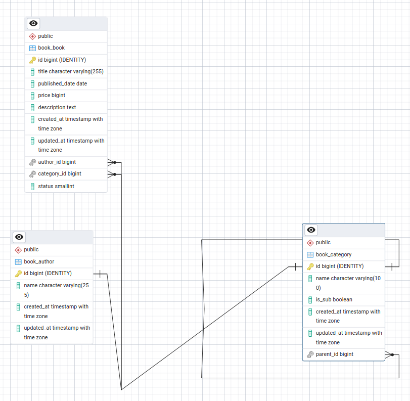

# Simple-library

This project allows users to create, read, update, and delete book records. It is built using Django and is based on a PostgreSQL database. For a better understanding of the project's data model, please refer to the Entity-Relationship Diagram (ERD) below:


## Features

- **Create, Read, Update, Delete (CRUD) functionality** for books.
- Based on **PostgreSQL** as the database.
- Uses **Django** as the web framework.
- A user-friendly admin interface for managing books and other resources.

## Prerequisites
- Python 3.x
- Django
- PostgreSQL
- pgAdmin (optional, for database management)
you can see in requirement.txt for details

## Installation

Follow the steps below to set up the project locally:

### Step 1: Clone the Repository

```bash
git clone https://github.com/SetareBehzadi/Simple-library.git
cd simple-library

```
### Step 2: Set Up a Virtual Environment
```bash
python -m venv venv
source venv/bin/activate  # On Windows use `venv\Scripts\activate`
```
### Step 3: Install Dependencies
```bash 
pip install -r requirement.txt
```
### Step 4:Configure Local Settings
Create a file named local_settings.py in the library directory to set up database parameters and the SECRET_KEY. Here is an example of what the local_settings.py file should contain:
```bash
SECRET_KEY = 'django-insecure*****************'

DB_NAME = 'database_name'
DB_PASSWORD ='database_password'
DB_HOST ='localhost'
DB_PORT ='5432'
DB_USER ='database_user'
```
### Step 5: Apply Migrations
Run the following commands to apply the migrations and set up the database tables:
```
python manage.py makemigrations
python manage.py migrate
```
### Step 6: Run the Development Server
Start the Django development server:
```
python manage.py runserver
```
Open your browser and navigate to http://127.0.0.1:8000/ to access the application.
